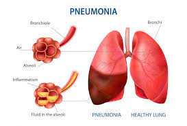
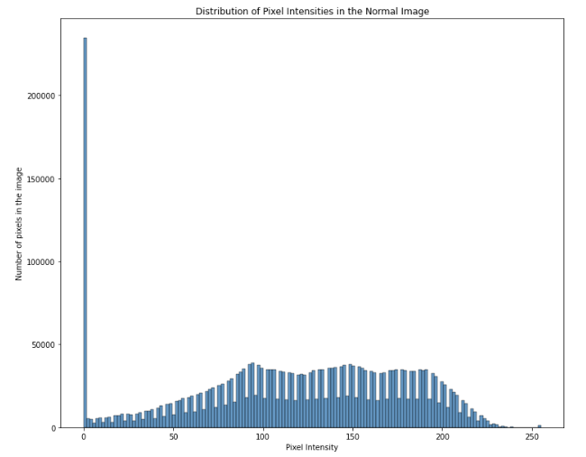
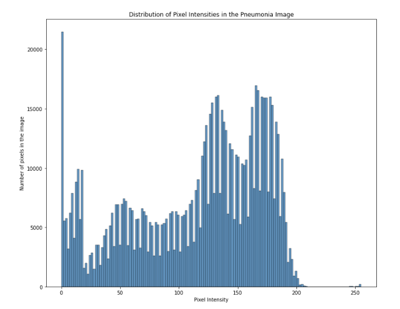
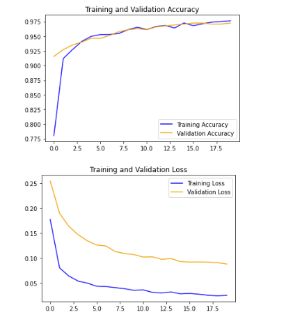
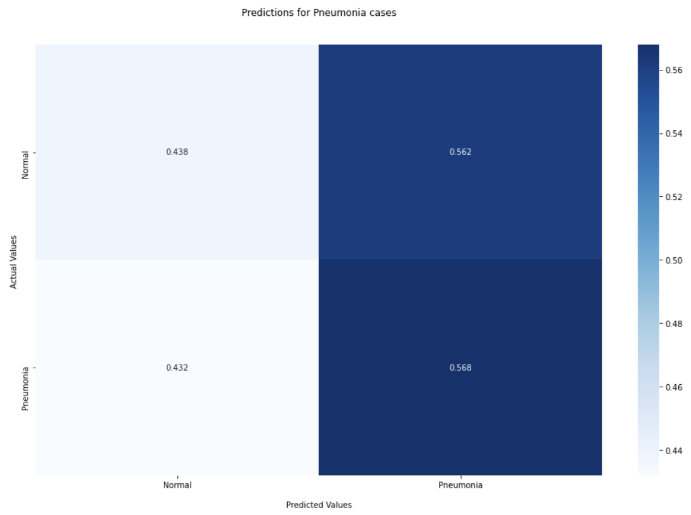
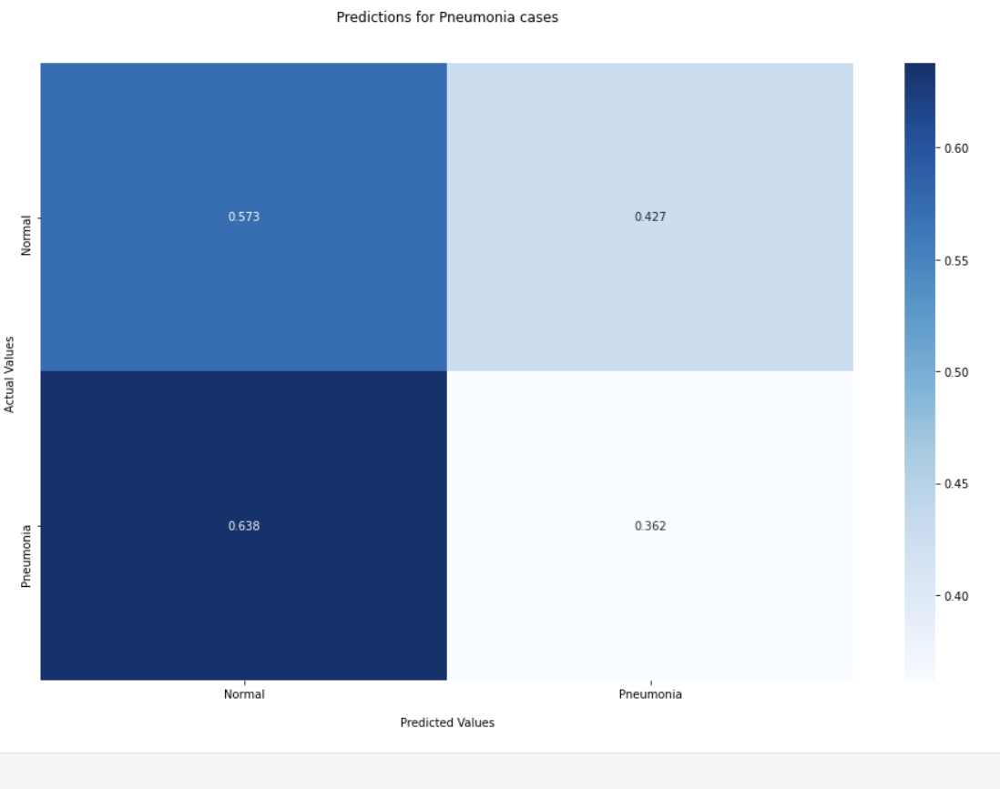

## Overview
This project uses Neural Networks (NN) to make predictions on a binary classification target for a hospital. The information came from a dataset provided on kaggle from Mendeley. The models created are looking to predict whether a patient has pneumonia or not


## Business Problem
Mt. Sinai hospital would like to leverage technology to screen patients for Pneumonia care in their day to day process. This technology has the opportunity to be used as a screening measure to help doctors become more efficient in helping patients who have pneumonia by identifying cases and bringing them in to ensure proper care.


 

## Data Understanding
The dataset was from Kaggle's chest xray dataset. It contained the following:

Train set: 
* PNEUMONIA=3875
* NORMAL=1341

Validation set: 
* PNEUMONIA=8
* NORMAL=8

Test set: 
* PNEUMONIA=390
* NORMAL=234

The dataset was modified to be:

Train set: 
* PNEUMONIA=3575
* NORMAL=1041

Validation set: 
* PNEUMONIA=308
* NORMAL=308


Test set: PNEUMONIA=390
          NORMAL=234

The data was modified due to the validation set data being extremely limited. Images from the train dataset were moved into the validation dataset in the correct folders.

This is what an image histogram for a normal x-ray looks like:




This is what an image histogram for a normal x-ray looks like:



## Modeling
The final chosen model was based on transfer learning from Resnet152V2. The model was pretrained and layers were added to further improve the model towards the data. The model ended with a Training Accuracy score of ~97.6% and Validation Accuracy score of ~97.2%



The confusion matrix on the validation set was able to detect 97.1% of the Pneumonia patients who had it.





## Evaluation
The accuracy of the model on the test set according to tensorflow's evaluate method was ~85.4%

The confusion matrix on the test data shows the results of the final Resnet152V2 model.




The model was able to detect 98.2% of Pneumonia patients that had Pneumonia in the test set.


## Conclusion

* The best model on the test set was model 14, the model using Resnet152V2. It had the best overall score as it predicted Pneumonia for Pneumonia X-rays 98.2% of the time and Normal for Pneumonia X-rays 1.8% the of the time. It also had the least trouble when it came to predicting Pneumonia in Normal cases as well. This model also had the best evaluate score on the test evaluation at ~85.4

* Model 13 was able to detect Pneumonia cases 99.5% of the time however, it is misclassifying normal cases as a much higher rate than model 14. This model also had the lowest test evaluation score of the 3 models at ~74%.

* Model 10 was very close to model 14 but model 14 was able to predict Pneumonia cases ~1.3% better and was more balanced than model 13. This model had an test evaluation score of ~82.7%

## Recommendations
This analysis leads to theses recommendation on what Mt. Sinai Hospital should do when it comes to Pneumonia care in their hospital:

* Use the resnet 152V2 model to screen patients to detect Pneumonia to provide care to them quickly and efficiently.

* Include more X-rays of the stages of Pneumonia in which patients can have.

* Permit the use of demographic data to see if demographic plays a role in likelihood of Pneumonia.

## For More Information
See the full analysis in the Jupyter Notebook or review this presentation.


For additional info, contact Jonathan Roman at [jonathan.roman1213@gmail.com](mailto:jonathan.roman1213@gmail.com)

## Repository Structure

```
├── images
├──.gitignore
├── README.md
├── nn_notebook.ipynb
├── presentation.pdf
```