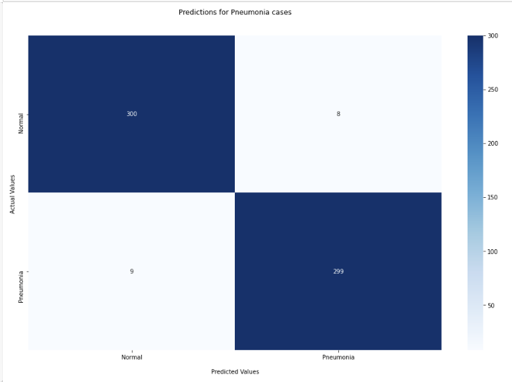

## Overview
This project uses Neural Networks (NN) to make predictions on a binary classification target for a hospital. The information came from a dataset provided on kaggle from Mendeley. The models created are looking to predict whether a patient has pneumonia or not

## Business Problem
A hospital wants to utilize technology to help diagnose patients who have Pneumonia correctly. It will greatly increase the efficiency of hospitals who have many pneumonia patients and could potentially use this technology as a screening process to better help patients.

 

## Data Understanding
The dataset was from Kaggle's chest xray dataset. It contained the following:

Train set: PNEUMONIA=3875
           NORMAL=1341

Validation set: PNEUMONIA=8
                NORMAL=8

Test set: PNEUMONIA=390
          NORMAL=234

The dataset was modified to be:

Train set: PNEUMONIA=3575
           NORMAL=1041

Validation set: PNEUMONIA=308
                NORMAL=308

Test set: PNEUMONIA=390
          NORMAL=234

The data was modified due to the validation set data being extremely low. Images from the train dataset were moved into the validation dataset in the correct folders.

## Modeling
The final chosen model was based on transfer learning from Resnet50. The model was pretrained and layers were added to further improve the model towards the data. The model ended with a Training Accuracy score of 92.3% and Validation Accuracy score of 91.8%

The confusion matrix on the validation set was able to detect 56.8% of the Pneumonia patients who had it.

The accuracy of the model on the test set according to tensorflow's evaluate method was ~73.2%

## Evaluation
The confusion matrix shows the results of the final Resnet50 model.

The model was only able to detect ~36% of Pneumonia patients that had Pneumonia.

## Conclusion
After working with several models to predict the outcomes of Pneumonia patients, the final model will need significant improvements as it does not outperform choosing only the majority class. 

More iterations and tuning will need to be done to make the model much more effective and useful in this context. Although several iterations and tweaking in the project were done, the results were not favorable.

## For More Information
See the full analysis in the Jupyter Notebook or review this presentation.

For additional info, contact Jonathan Roman at [jonathan.roman1213@gmail.com](mailto:jonathan.roman1213@gmail.com)
